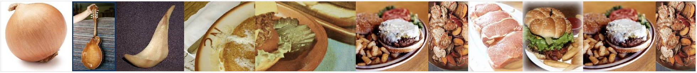
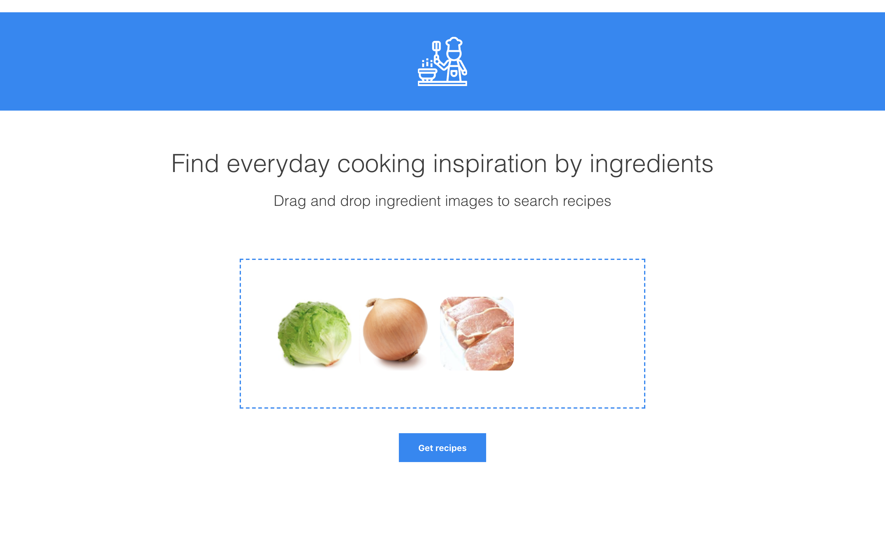
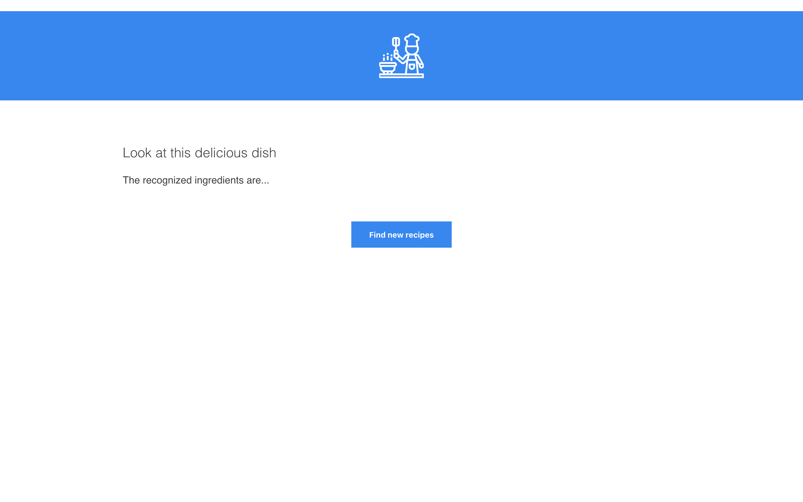
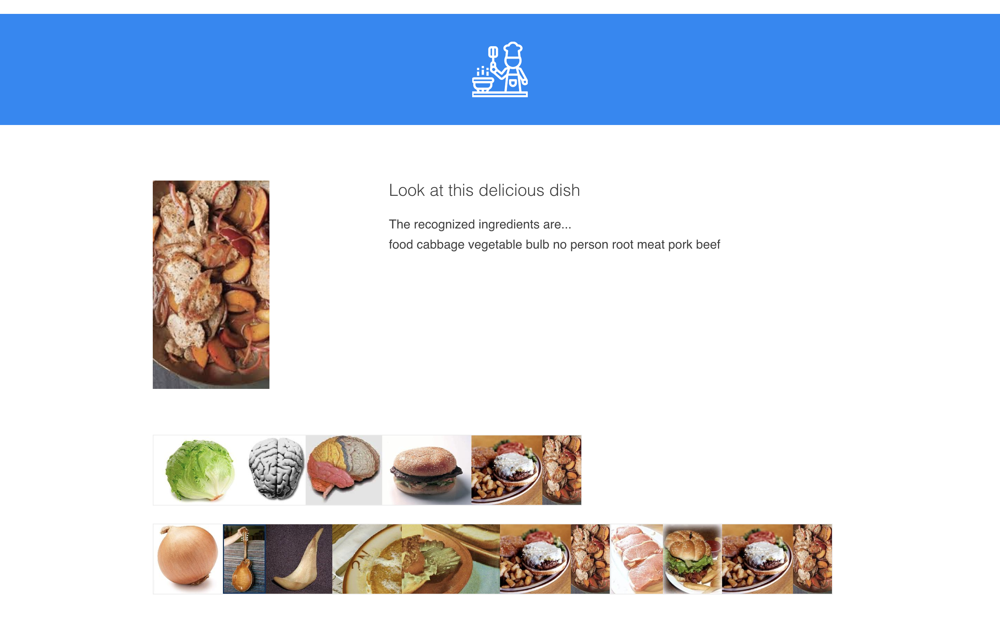

# Recipe Recommender
A creative project to suggest a recipe from certain ingredient images. 
The project is using web scraping, PCA, and kNN techniques and is implemented by Javascript and Python.

User will choose some images of ingredients, the application will give you a cuisine and will show you how to turn the ingredient to the cuisine by image transfer.

	

## Node Server/Client
#### server.js
Connect the python script and communicate with the client webpage.

#### public/imageTransfer.js
Receive and send data from/to the server.

#### public/dropzone.js
The code for Dropzone

## Python Script
#### recipe.py
Get ingredient keywords from server and go online to scrape the cuisine image online.

#### useownimg.py
Do PCA and kNN in Caltech256 database. Look for the shortest image path between the ingredient image and the cuisine image.

## Result

	
	
	

